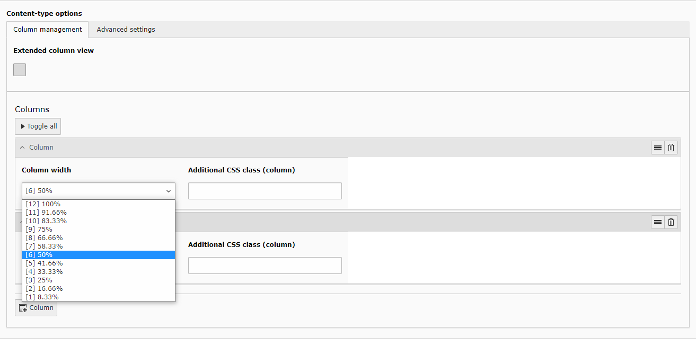

.. include:: /Includes.rst.txt
.. index:: Configuration
.. _configuration-general:

=====================
General configuration
=====================

| Download the extension and include its static template.
| See: :ref:`installation`

---------------------
Basic
---------------------

| Add at least one column via the button :typoscript:`+Column`.
| Individual width and an optional css class can be set.
| 

---------------------
Extended
---------------------

| The extended view can be globally activated for alle columns via the checkbox "Extended column view".
| For each clumn the width, order (1-9) and offset can be set for 4 breakpoints (mobile, tablet, small- and large desktop)
| Additionally a background color can be set. Either choose a customized hex value or one of the potentially predefined background colors, see :ref:`configuration-background-colors`

