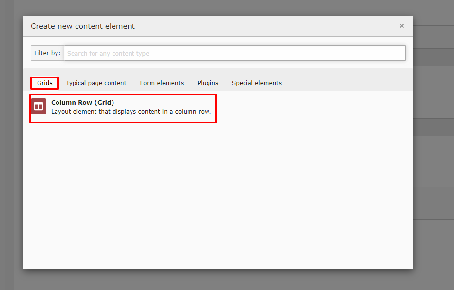
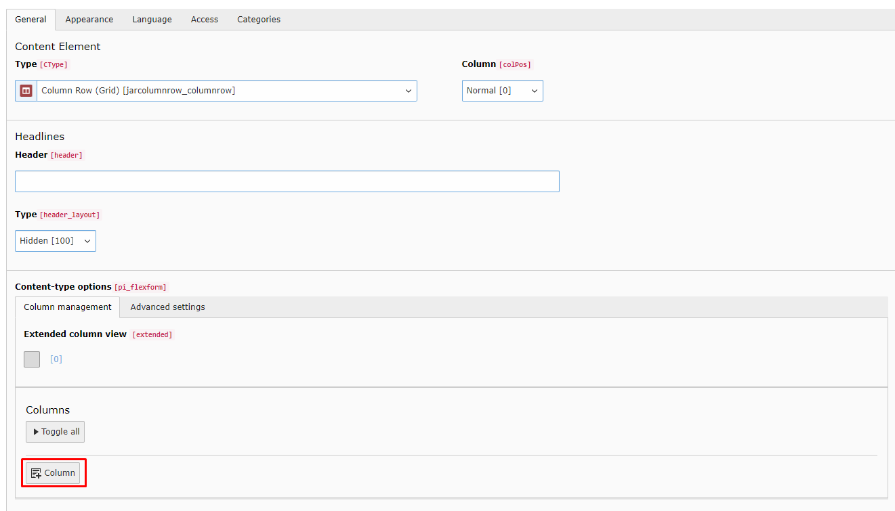
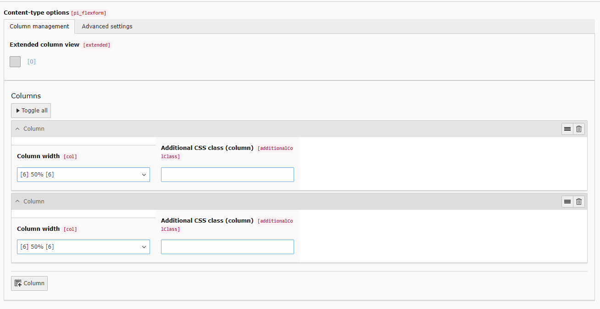
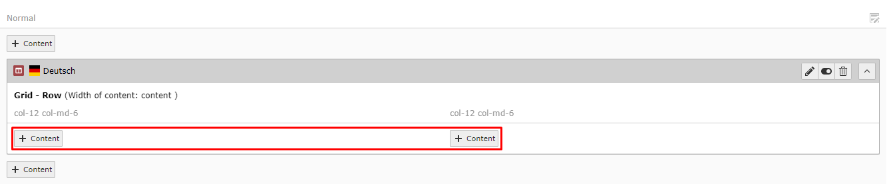
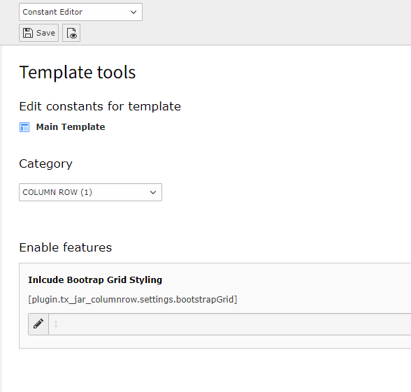
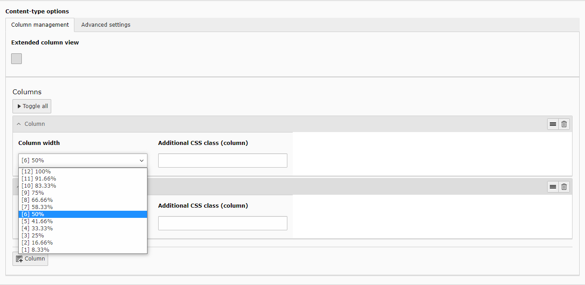
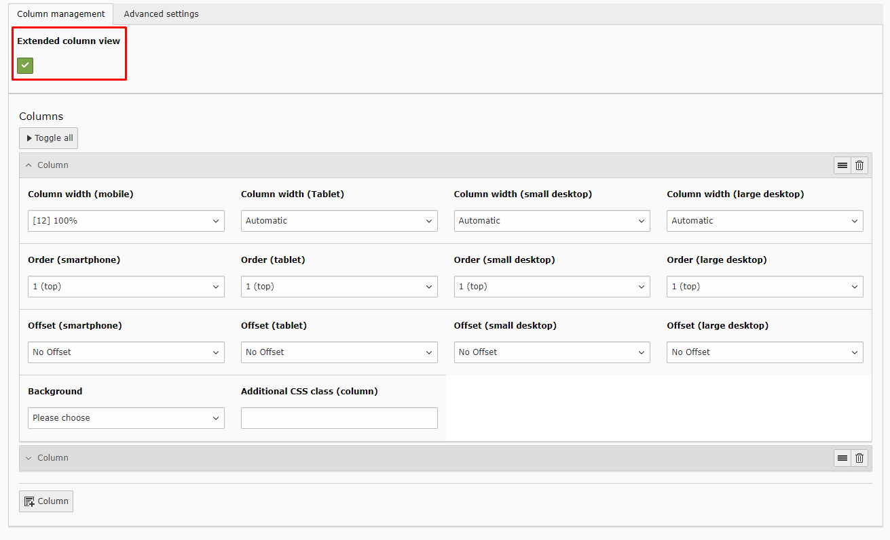
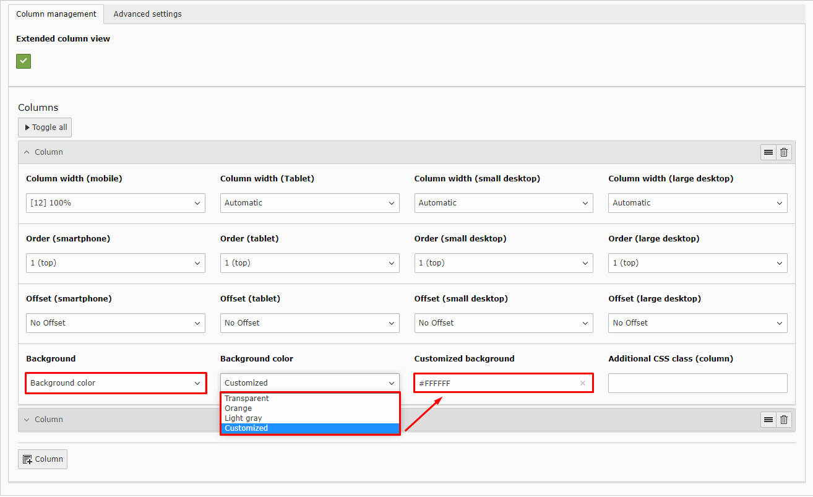
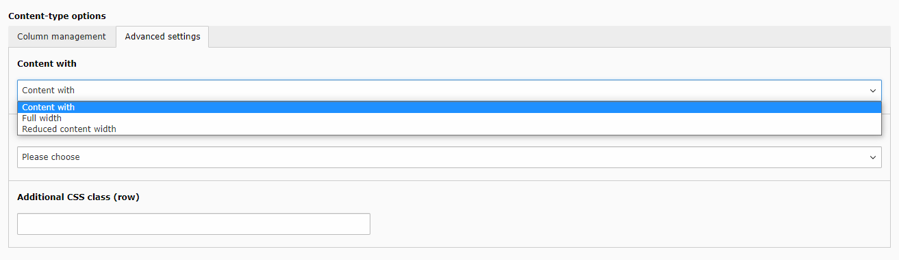
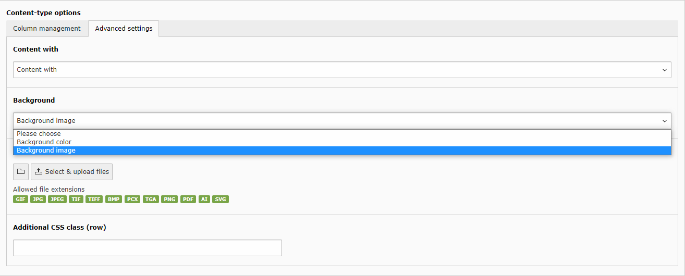

.. every .rst file should include Includes.txt
.. use correct path!

.. include:: /Includes.rst.txt

.. Every manual should have a start label for cross-referencing to
.. start page. Do not remove this!

.. _start:

=============================================================
Jar ColumnRow
=============================================================

:Version:
   1.0

:Language:
   en

:Description:
This extension provides a grid layout container where multiple columns with 12 different widths can be added.
In the so called 'Column Row'-Element the column width, order and offset can be customized for 4 different breakpoints via the backend.

:Authors:
   Julian Lichte, Maurice Möllmer

:Email:
   typo3jarcolumnrow@jcdn.de

:License:
   `GNU General Public License <http://www.gnu.org/copyleft/gpl.html>`_ .

**TYPO3**

The content of this document is related to TYPO3 CMS,
a GNU/GPL CMS/Framework available from `typo3.org <https://typo3.org/>`_ .

**Community Documentation**

This documentation is community documentation for the TYPO3 extension Jar ColumnRow

It is maintained as part of this third party extension.

If you find an error or something is missing, please:
`Report a Problem <https://github.com/TYPO3-Documentation/TYPO3CMS-Example-ExtensionManual/issues/new>`__

**Extension Manual**

This documentation is for the TYPO3 extension Jar ColumnRow.

..   Note for editors:
..   temporarily removed from menu:
..   Introduction/Index

.. toctree::
   :maxdepth: 1

   Introduction/Index

.. toctree::
   :maxdepth: 3

   QuickStart/Index
   Configuration/Index

.. toctree::
   :maxdepth: 1

   Sitemap
   genindex
   About
   Targets

---------------------------------------------------------------------------------

Author
------

This extension has been created by `JAR Media <https://jar.media>`__, a brand of `invokable <https://invokable.gmbh>`__.

.. image:: /Images/jarmedia_logo.svg
   :alt: JAR Media - be creative. and relax
   :target: https://jar.media/
   :width: 300

.. image:: /Images/spacerblock_40x40.png   

.. image:: /Images/invokable_logo.svg
   :alt: invokable GmbH
   :target: https://invokable.gmbh/
   :width: 300
.. include:: /Includes.rst.txt
.. index:: Quickstart
.. _quickstart:

Quickstart
========

Follow the steps below to set up a simple grid element with two rows.

.. _installation:

Installation
----------

Install the extension jar_columnrow via extension manager or via composer (recommended):

.. code-block:: none

	composer require jar/jar_columnrow

You can find the current version (and older ones) at

TBA

Include static template
-----------------------

In your main template include the static template "Jar Column Row" of the extension jar_columnrow.

Add Column Row
------------

Navigate to a page with the page module enabled and add a new content element.
|Choose "Column Row" in the new tab "Grids".

Configure Element
-----------------

You can add new columns in the repeater at the bottom

In basic view you can now choose the width of each column.
For example two columns with 50% each.

After saving and exiting, you can add content elements inside your new column rows either by creating or simply by drag and drop.

.. include:: /Includes.rst.txt
.. highlight:: typoscript
.. index:: Background Colors
.. _configuration-background-colors:

Define Background Colors
==================

| In each grid container one can choose a background color.
| Adding this to the PageTS config adds the possibility to define custom background colors to use exactly the same colors in any grid container.

------------

.. confval:: jar.bgcolors

   :type: object

   | Multiple colors can be added to each grid container :typoscript:`Label => Value`
   | Of course either plain labels or `XLIFF <https://docs.typo3.org/m/typo3/reference-coreapi/main/en-us/ApiOverview/Internationalization/XliffFormat.html>`__ can be used.
   |

   Example::

      jar {
         bgcolors {
            LLL:EXT:jar_columnrow/Resources/Private/Language/locallang_be\.xlf:orange = #ED672C
            LLL:EXT:jar_columnrow/Resources/Private/Language/locallang_be\.xlf:light_gray = #A5A5A5
         }
      }

.. include:: /Includes.rst.txt
.. highlight:: typoscript
.. index:: Include Bootrap Grid

.. _configuration-bootstrapgrid:

=====================
Include Bootrap Grid
=====================

.. confval:: bootstrapGrid

   :type: bool
   :Default: true

   If :php:`true`, the bootstrap grid css is included for basic grid styling.

   Example::

      plugin.tx_jar_columnrow.settings {
         bootstrapGrid = true
      }

Change via the Constant Editor
""""""""""""""

.. include:: /Includes.rst.txt
.. index:: Configuration
.. _configuration-general:

=====================
General configuration
=====================

| Download the extension and include its static template.
| See: :ref:`installation`

---------------------
Basic
---------------------

| Add at least one column via the button :typoscript:`+Column`.
| Individual width and an optional css class can be set.

.. note:: It's in the responsibility of the editor to choose the width of each column wisely.

---------------------
Extended
---------------------

| The extended view can be globally activated for alle columns via the checkbox "Extended column view".
| For each clumn the width, order (1-9) and offset can be set for 4 breakpoints (mobile, tablet, small- and large desktop)
| 

| 
| Additionally a background color can be set. Either choose a customized hex value or one of the potentially predefined background colors, see :ref:`configuration-background-colors`.
| 

---------------------
Advanced
---------------------

| Under the tab :typoscript:`Advanced Settings` one can configure the content width and background for the whole row.
| There is also the option of giving an additional css class to the row for individual styling.
| 

| 
| For choosing a background there can be chosen a color or a image.
| Both will unlock new fields to set this up.
| 

.. include:: /Includes.rst.txt

.. _configuration:

=============
Configuration
=============

.. toctree::
   :maxdepth: 5
   :titlesonly:

   General
   BootstrapGrid
   BackgroundColors

